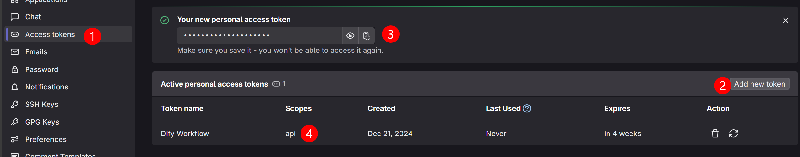
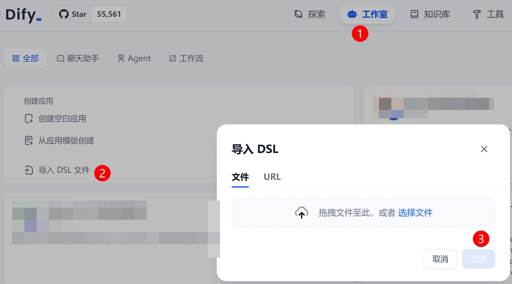
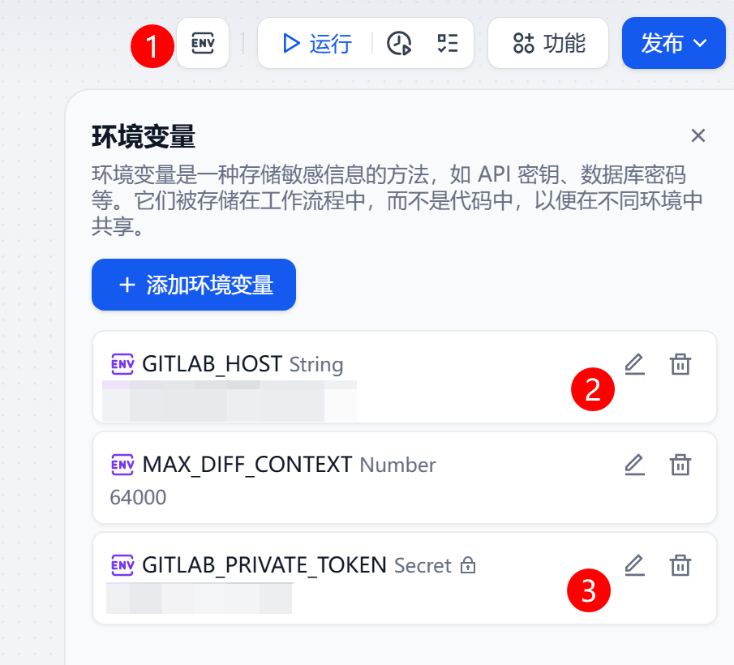
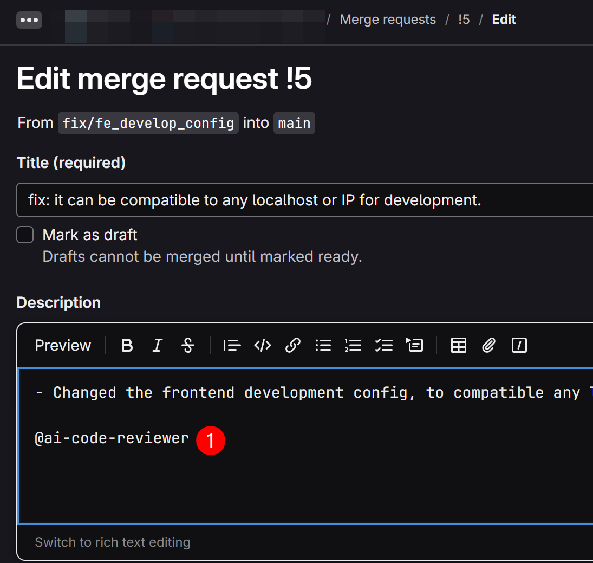
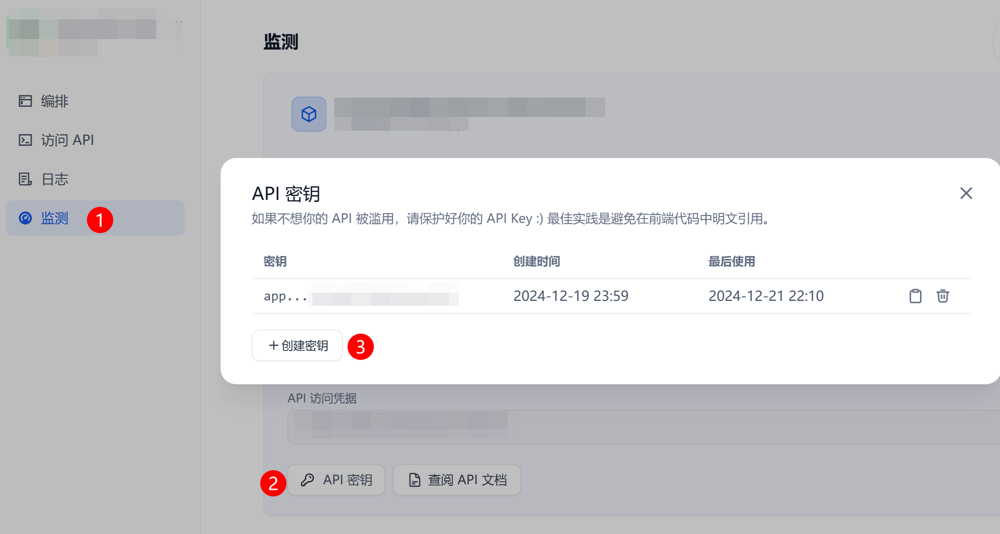
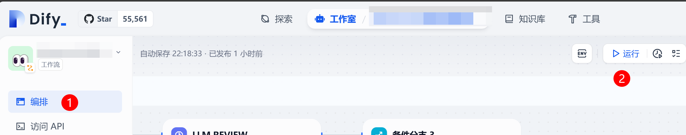

# Dify GitLab MR Reviewer

Dify GitLab MR Reviewer is a tool designed to automate the code review process for GitLab Merge Requests (MRs). It integrates with the Dify workflow to provide intelligent code review suggestions, helping developers identify potential issues and improve code quality.

## Features

- **Automated Code Review**: Automatically reviews GitLab MRs and provides feedback.
- **Integration with Dify**: Utilizes the Dify workflow for advanced code analysis.
- **Docker Trigger Support**: Easy deployment using Docker containers to trigger the workflow.
- **Logging and Monitoring**: Detailed logging and monitoring to ensure robust operation.

## Prerequisites

Before you begin, ensure you have the following installed:

- [GitLab](https://about.gitlab.com/) This reviewer can be applied to free GitLab instance. You need a personal access token to an account with access (Role `developer` at least) to the repository.
- [Dify](https://github.com/langgenius/dify) The AI workflow platform. You have to get the workflow URL and access token.
- [Docker](https://www.docker.com/) Optional. If not, you can call the Dify workflow API by yourself.

## Installation

### 1. Get the GitLab Personal Access Token:



Please note the token must have the `api` scope. This GitLab account will post comments when reviewing MRs. So please remember the GitLab account name.

### 2. Import the workflow into Dify:

Select the file `dify-workflow.yml` to import.



Then adjust your workflow environment variables.



Sample:  
```
GITLAB_HOST = https://gitlab.your-company.com
GITLAB_PRIVATE_TOKEN = <The token you retrived from the first step>
```

The workflow is default using the [**Google Gemini 2.0 Flash Exp**](https://aistudio.google.com/apikey). You can change to any other LLM model.

### 3. Refer the reviewer account from the MR description.

Still remember the GitLab account name? Just @ the reviewer account in the MR description. And save it.



### 4. (Optional) Get Dify URL and API Key

This is for autommatically trigger the workflow.  
Get the workflow URL, it looks like:
```
https://your-dify-host/v1/workflows/run
```  
And the API key from the workflow page:


You will need the URL and API key to trigger the workflow.

### 5. (Optional) The Trigger Script Setup

**Build the Docker Image**:
   ```sh
   docker build -t gitlab-mr-reviewer-trigger .
   ```

**Run the Docker Container**:
   ```sh
   docker run --restart=always -d \
     --name gitlab-mr-reviewer-trigger \
     -e DIFY_URL=<your-dify-host> \
     -e DIFY_API_KEY=<your-dify-access-token> \
     gitlab-mr-reviewer-trigger
   ```


### 6. (Optional) Trigger the Workflow manually.

Just click the run button in the workflow page for each time you want to trigger the workflow. Each run will review one MR.



### 7. Done

Take a break and see what the AI has to say!

## Environment Variables

The following environment variables are required for the script to function correctly:

| Name               | Description                                                                 | Default |
|--------------------|-----------------------------------------------------------------------------|---------|
| `DIFY_URL`         | The URL of the Dify workflow. <br>For example: `https://your-dify-host/v1/workflows/run` | `null`  |
| `DIFY_API_KEY`| The access token to the Dify workflow.                                      | `null`  |
| `DIFY_MAX_RETRIES` | Max retries to access the Dify API.                                         | `3`     |
| `DIFY_TIMEOUT`     | The timeout in seconds to run the workflow.                                 | `1800`  |
| `DIFY_MIN_INTERVAL`| Minimum interval in seconds between each API call.                          | `60`    |

## Trigger Script Logging

The script logs all activities to the `logs` directory. The log files are named `dify_monitor.log`. The logs include detailed information about the script's operation, including:

- **INFO**: General information about the script's operation.
- **WARN**: Warnings that do not necessarily indicate an error.
- **ERROR**: Errors that may require attention.

## Workflow Configuration

The workflow configuration is defined in the `dify-workflow.yml` file. It is exported from Dify. I don't recommend to change it manually, but just modify it from Dify and export a new one if you need to.

## Trigger Script

The `trigger.sh` script is responsible for monitoring the Dify workflow and handling the interaction with the GitLab API. It includes functions for logging, reading configuration, prettifying JSON output, and monitoring the Dify Workflow.

## Dockerfile

The `Dockerfile` sets up a Docker container with the necessary dependencies (`curl`, `jq`, `bc`) and runs the `trigger.sh` script. This containerization ensures that the monitoring script can be run in a consistent environment across different systems.

## Contributing

Contributions are welcome! Please read the [contributing guidelines](CONTRIBUTING.md) to get started.

## License

This project is licensed under the MIT License. See the [LICENSE](LICENSE) file for details.
