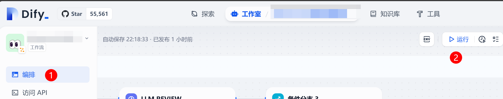

# Dify GitLab MR Reviewer

Dify GitLab MR Reviewer is a tool designed to automate the code review process for GitLab Merge Requests (MRs). It integrates with the Dify workflow to provide intelligent code review suggestions, helping developers identify potential issues and improve code quality.

## Features

- **Automated Code Review**: Automatically reviews GitLab MRs and provides feedback.
- **Integration with Dify**: Utilizes the Dify workflow for advanced code analysis.
- **Docker Trigger Support**: Easy deployment using Docker containers to trigger the workflow.
- **Logging and Monitoring**: Detailed logging and monitoring to ensure robust operation.

## Prerequisites

Before you begin, ensure you have the following installed:

- [GitLab](https://about.gitlab.com/) This reviewer can be applied to free GitLab instance. You need a personal access token to an account with access (Role `developer` at least) to the repository.
- [Dify](https://github.com/langgenius/dify) The AI workflow platform. You have to get the workflow URL and access token.
- [Docker](https://www.docker.com/) To proxy the GitLab system hook requests to Dify, or run a cronjob to trigger the Dify workflow.

## Installation

### 1. Get the GitLab Personal Access Token


Please note the token must have the `api` scope. This GitLab account will post comments when reviewing MRs. So please remember the GitLab account name.

### 2. Import the workflow into Dify

Select the file `dify-workflow.yml` to import.


Then adjust your workflow environment variables.


Sample:

```
GITLAB_HOST = https://gitlab.your-company.com
GITLAB_PRIVATE_TOKEN = <The token you retrived from the first step>
```

The workflow is default using the [**Google Gemini 2.0 Flash Exp**](https://aistudio.google.com/apikey). You can change to any other LLM model.

// TODO remember the workflow URL and API key

### 3. Setup a System Hook to GitLab

// TODO

### 4. Setup the trigger service.

This is for autommatically trigger the workflow.  
Get the workflow URL, it will be refered as `DIFY_URL` in following steps. It looks like:

```
https://your-dify-host/v1/workflows/run
```

And the API key from the workflow page, it will be refered as `DIFY_API_KEY` in follwoing steps:


You will need the URL and API key to trigger the workflow.

### 5. (Optional) The Trigger Script Setup

**Build the Docker Image**:

```sh
docker build -t gitlab-mr-reviewer-trigger .
```

**Run the Docker Container**:

```sh
docker run --restart=always -d \
  --name gitlab-mr-reviewer-trigger \
  -e DIFY_URL=<your-dify-workflow-url> \
  -e DIFY_API_KEY=<your-dify-api-key> \
  gitlab-mr-reviewer-trigger
```

### 6. (Optional) Trigger the Workflow manually

If you don't trigger the workflow automatically, you can just click the run button in the workflow page for each time you want to trigger it. Each run will review one MR.



### 7. Done

Take a break and see what the AI has to say!

## Contributing

Contributions are welcome! Please read the [contributing guidelines](CONTRIBUTING.md) to get started.

## License

This project is licensed under the MIT License. See the [LICENSE](LICENSE) file for details.
